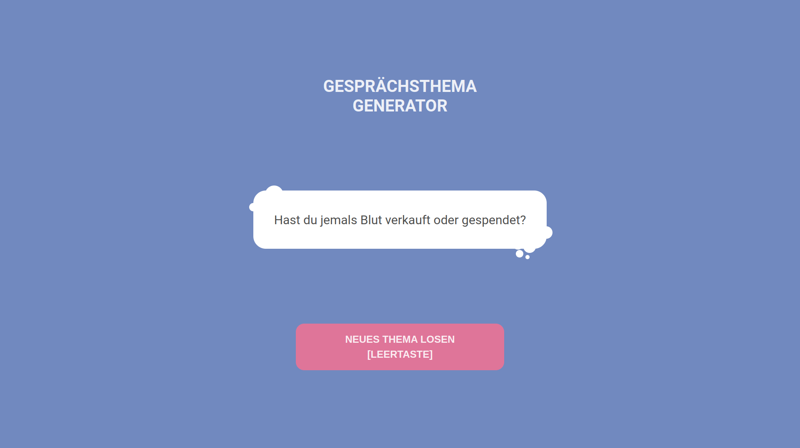

<span align="center">
<h1>Conversation Topic Generator</h1>
<p>v0.0.1</p>
</span>

Simple party game written in Go, HTML, CSS and TypeScript (svelte-kit).



<br />

## Usage

```bash
# clone project
git clone https://github.com/cokejoke/conversation-topic-generator
```

```bash
# run production build
$ docker-compose up -d
```

<hr />
Other useful commands:

```bash
# run production build (with rebuild in case of new changes)
$ docker-compose up -d --build

# view docker logs
$ docker-compose logs -t -f

# close docker process
$ docker-compose down
```

<br /> <hr/>

## Configuration

To change configuration options open the `docker-compose.yml` file and edit them there.

<br /> <hr/>

## Credentials

The default login is <b>admin</b> and the password is <b>kcolrehs</b>

<br /> <hr/>

## Licensing

Distributed under the MIT License. See [LICENSE](LICENSE) for more information.